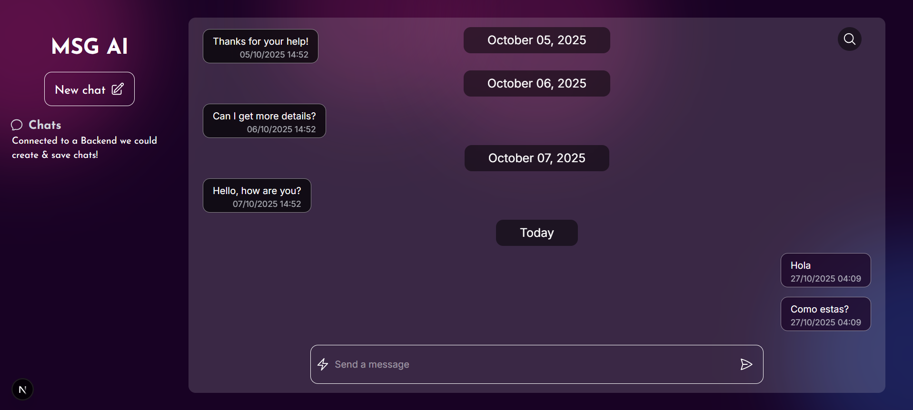
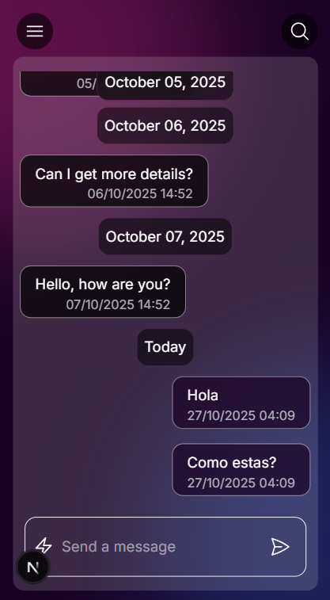

# 🧠 Msg AI

A clean, responsive chat interface built with **Next.js (App Router)**, **TypeScript**, and **Tailwind CSS**.  
Designed to simulate an AI messaging experience with grouped messages, date separators, and a modern UI.

---

## 🚀 Features

- 💬 **Chat interface** with smooth scrolling
- 📅 **Messages grouped by date** for better organization
- 📱 **Responsive design** built with Tailwind CSS
- 🎨 **Interactive UI** — hover effects, icons, and input focus handling
- ⚡ **Built on App Router** structure with modular components

---

## ⚙️ Setup & Installation

### 1) Clone the repo
```
git clone https://github.com/Pedrosky21/MsgAi.git
cd msg-ai
```
### 2) Install dependencies & run the app
```
npm i
npm run dev
```
### 3) Run the app
Open http://localhost:3000 in your favorite browser

---

## 🧩 Tech Stack

| Category | Technology |
|:----------|:------------|
| Framework | [Next.js 14+] |
| Language | [TypeScript] |
| Styling | [Tailwind CSS] |
| Icons | [Heroicons] |

---

## 📸 Screenshots



---

## 📂 Project Structure
msg-ai/
|  ├── src/
|  |  ├── app/
|  |  |  ├── components/
|  |  |  ├── messages/components/
|  |  ├── api/
|  ├── types/
|  ├── utils/
|  ├── public/

---

## 👨‍💻 Technical decisions

### 🧩 Tech Stack
- **Next.js (App Router)** — chosen for its performance, built-in TypeScript support, and hybrid rendering (SSR/SSG).  
- **TypeScript** — ensures static typing and helps prevent runtime errors.  
- **Tailwind CSS** — provides rapid UI development with a clean, responsive design system.  
- **Anime.js** — used for smooth and modern message bubble animations.

---

### ⚡ Rendering & Performance
- Uses **reverse rendering** (`flex-col-reverse`) to keep the newest messages visible.  
- Smooth scrolling implemented with the native `scrollTo()` API.  
- **Only the latest message** triggers the animation, reducing unnecessary re-renders.

---

### 🎨 Design & UX
- Minimalistic dark interface with **pink highlights** for contrast and visual identity.  
- Fully styled using **Tailwind CSS** for flexibility and responsiveness.  
- **Anime.js** adds dynamic transitions and message animations for a polished experience.  

---

### 🧠 Future or Discarded Decisions
- **Discarded:** manage more than one chat.  
- **Discarded:** integration with **Auth0** for authentication and user sessions.  
- **Discarded:** replace mock data with a **real API**.

---

## 👤 Autor
Pedro Arreguez  
LinkedIn: (https://www.linkedin.com/in/pedro-arreguez-6785261b8/)
